# WhistleDrop

A confidential reporting backend. Anyone can submit a report **without an account and without revealing who they are**. Moderators review and manage reports through an API or a built-in dashboard, and reporters can track progress with a private case code. GDG on Campus SRM Recruitment 2026-27 (Backend task).

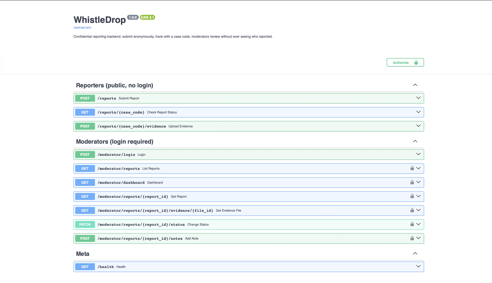

## Features
- Anonymous report submission (category, description, optional evidence URL, optional evidence images)
- Unguessable case codes for tracking (128 bits of randomness)
- Moderator login (JWT), filter by category/status, keyword search, status workflow with short updates
- Notes that don't change status (e.g. "still investigating")
- A small built-in moderator dashboard at `/dashboard`
- Evidence image upload with metadata (GPS, camera, timestamps) stripped before storage
- Strict, **permanent** workflow: `SUBMITTED -> UNDER_REVIEW -> RESOLVED / DISMISSED`; the two end states cannot be reopened
- Automated tests (28), Swagger/OpenAPI docs, Docker and Render deployment configs

## Tech stack
Python 3.11+, FastAPI, SQLAlchemy 2.0, SQLite (PostgreSQL in production), Pydantic v2, PyJWT, argon2-cffi, Pillow, pytest

## Setup
```bash
git clone https://github.com/CloudyHAZE1910/whistledrop-backend.git
cd whistledrop-backend
python -m venv .venv
# Windows:      .venv\Scripts\activate
# Mac / Linux:  source .venv/bin/activate
pip install -r requirements.txt

# optional but recommended for real use
export WHISTLEDROP_SECRET="a-long-random-string"     # Windows PowerShell: $env:WHISTLEDROP_SECRET="..."

python create_moderator.py                            # create a moderator account
uvicorn app.main:app --no-access-log                  # start the API
```
Open **http://127.0.0.1:8000/docs** for interactive documentation, or **http://127.0.0.1:8000/dashboard** for the moderator dashboard. Run the tests with `python -m pytest -v`.

## API endpoints
| Method | Path | Who | Purpose |
|---|---|---|---|
| POST | `/reports` | Anyone | Submit an anonymous report, returns a case code |
| GET | `/reports/{case_code}` | Anyone with the code | Check status and moderator updates |
| POST | `/reports/{case_code}/evidence` | Anyone with the code | Upload a PNG/JPEG evidence image (max 3 per report, 5 MB each) |
| POST | `/moderator/login` | Moderator | Get an access token |
| GET | `/moderator/dashboard` | Moderator | Report counts by status/category, and the newest reports |
| GET | `/moderator/reports` | Moderator | List reports (filters: `category`, `status`, `q`, `limit`, `offset`) |
| GET | `/moderator/reports/{id}` | Moderator | View one report |
| GET | `/moderator/reports/{id}/evidence/{file_id}` | Moderator | Download one evidence image |
| PATCH | `/moderator/reports/{id}/status` | Moderator | Change status and add a short update |
| POST | `/moderator/reports/{id}/notes` | Moderator | Add a note **without** changing status |
| GET | `/dashboard` | Moderator (via the page's own login form) | The built-in dashboard UI |

Status codes used: `201` created, `200` ok, `401` missing/invalid token or credentials, `404` not found, `409` invalid status transition or a permanently closed case, `413` file too large, `422` invalid input.

## Screenshots: a full case, start to finish

**1. Reporter submits a report anonymously.**

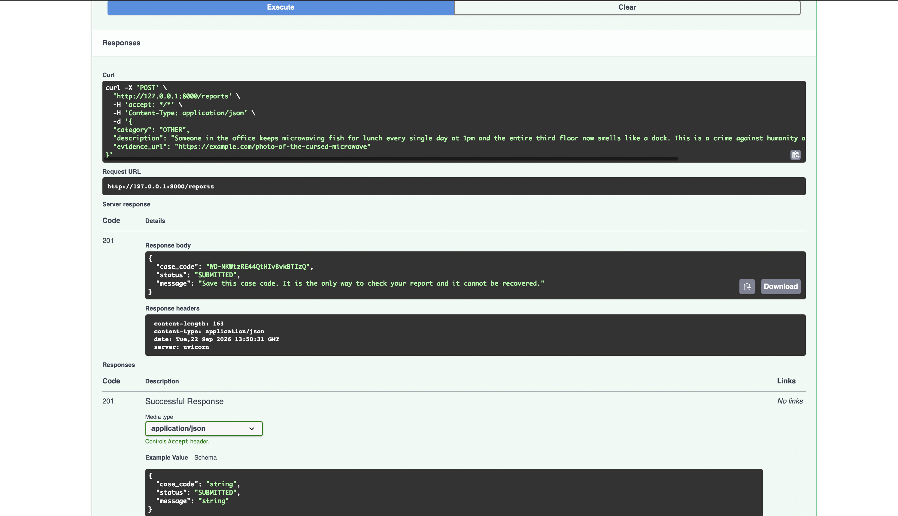

**2. Reporter checks status with the case code.**

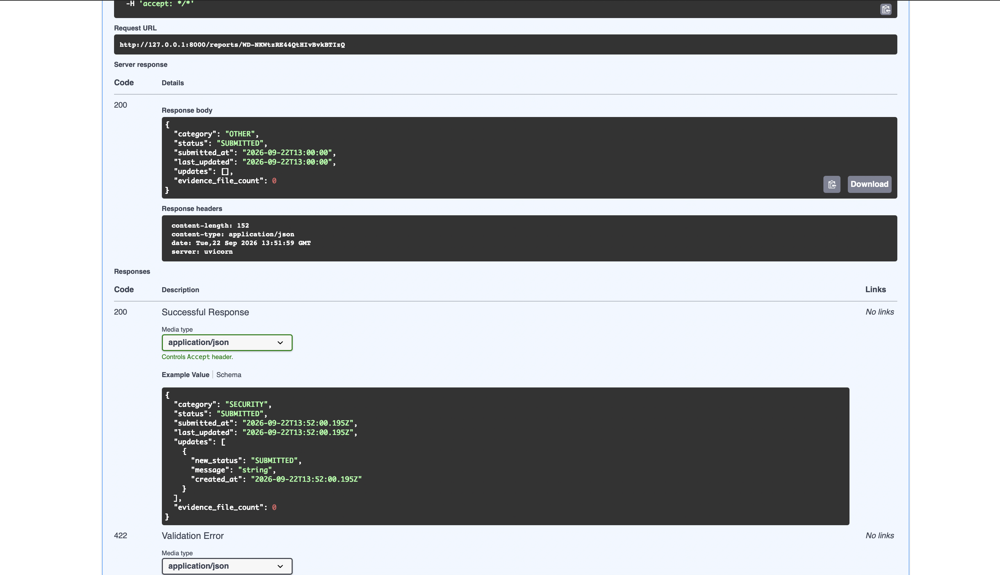

**3. Reporter uploads evidence:** the image's metadata is stripped before storage.

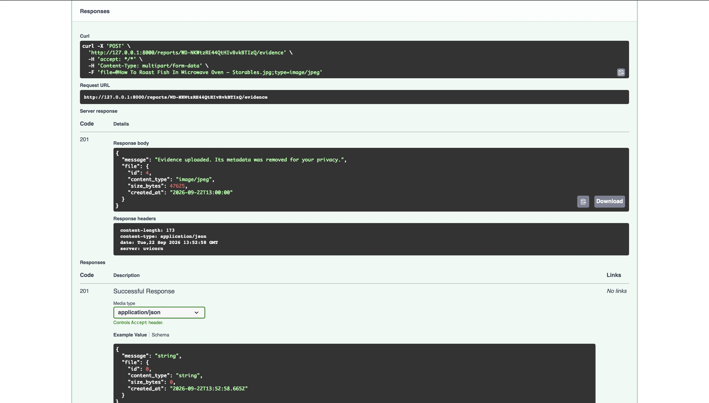

**4. Moderator logs in to get an access token.**

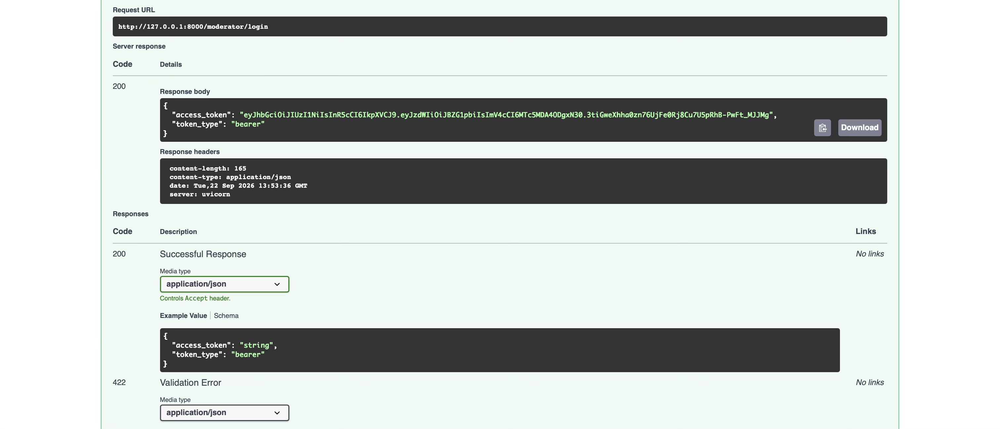

**5. No token, no access:** the same endpoint rejects an unauthenticated request.

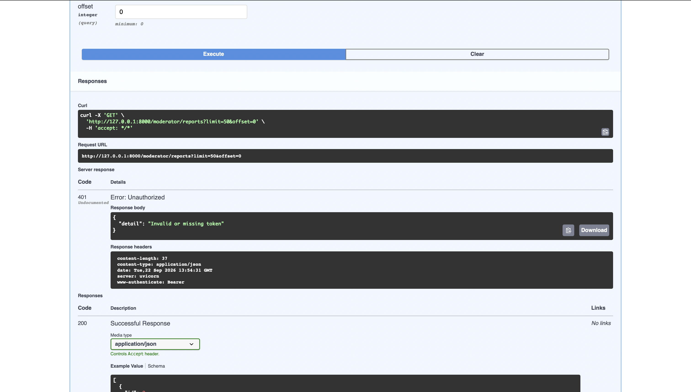

**6. Moderator lists reports:** evidence attached and allowed next statuses shown, no reporter info anywhere.

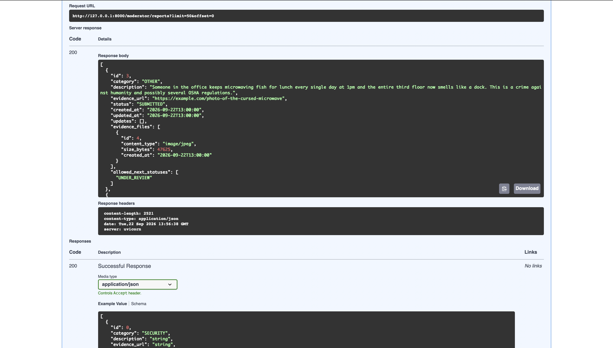

**7. Moderator downloads the evidence file** — moderators only, served as an attachment.

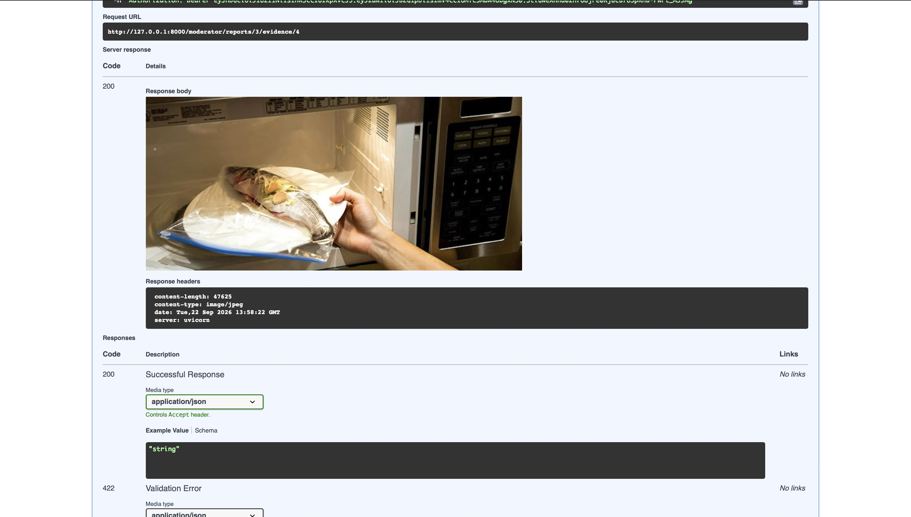

**8. Moderator dashboard:** counts by status/category and the newest reports.

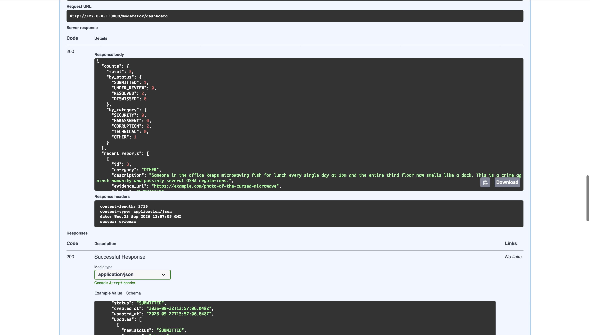

**9. Moderator moves the report through the workflow** from the dashboard.

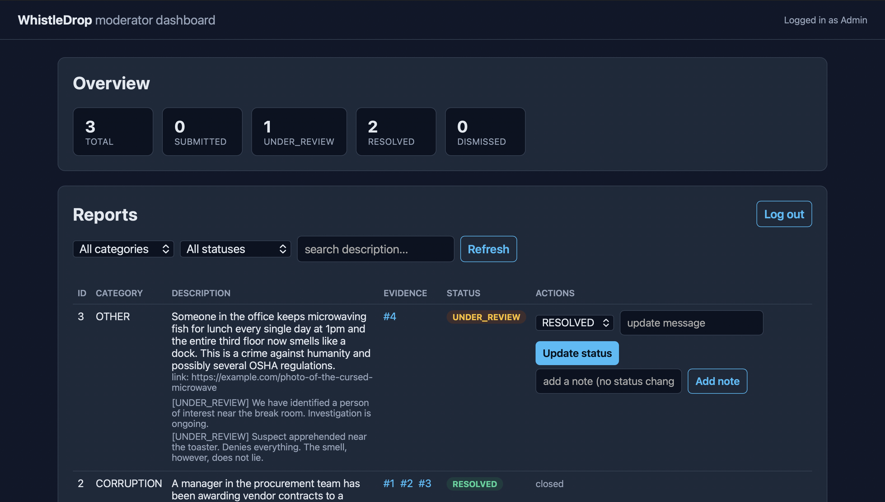

**10. The case is resolved and closed:** full note history, no further actions available.

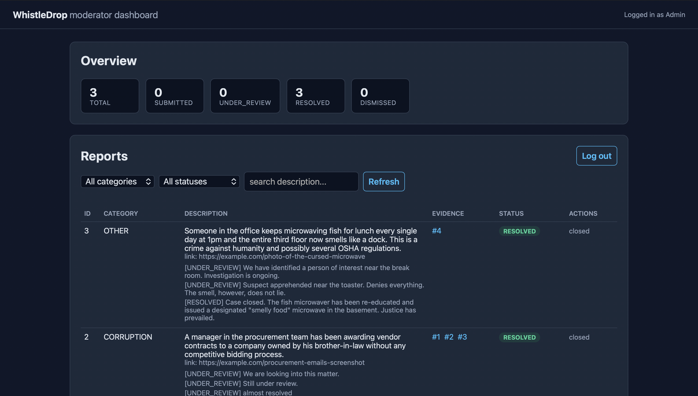

**11. Reporter's final view:** every note plus the resolution, all through one case code.

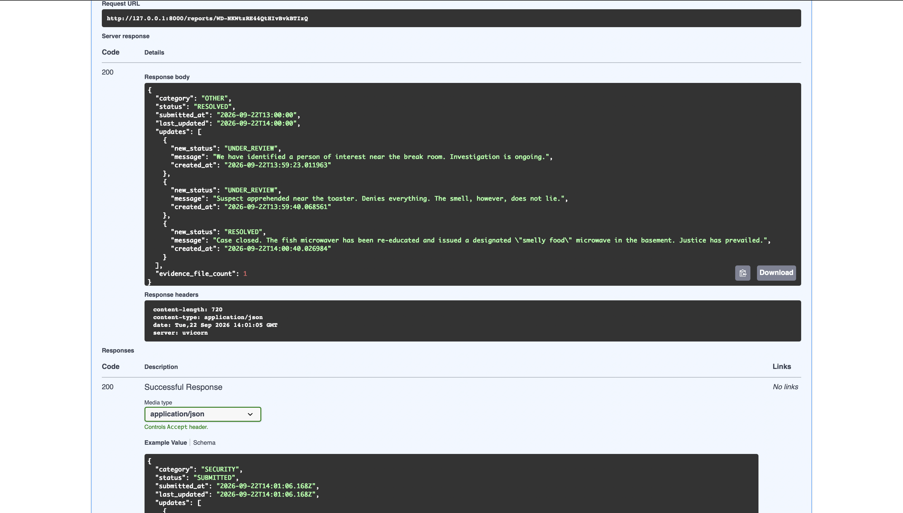

**12. A wrong or made-up case code reveals nothing** — same response either way.

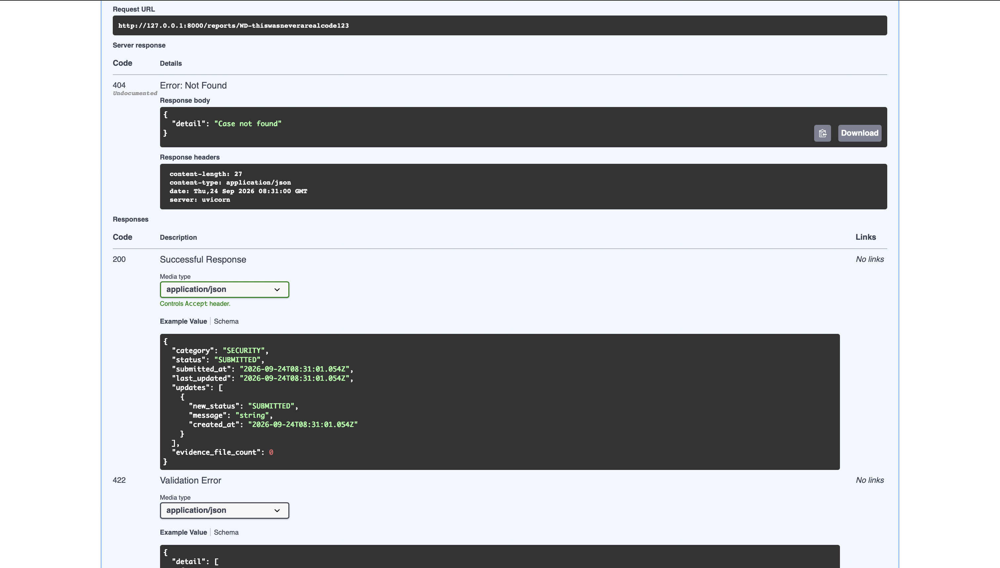

**13. Input validation rejects a description that's too short.**

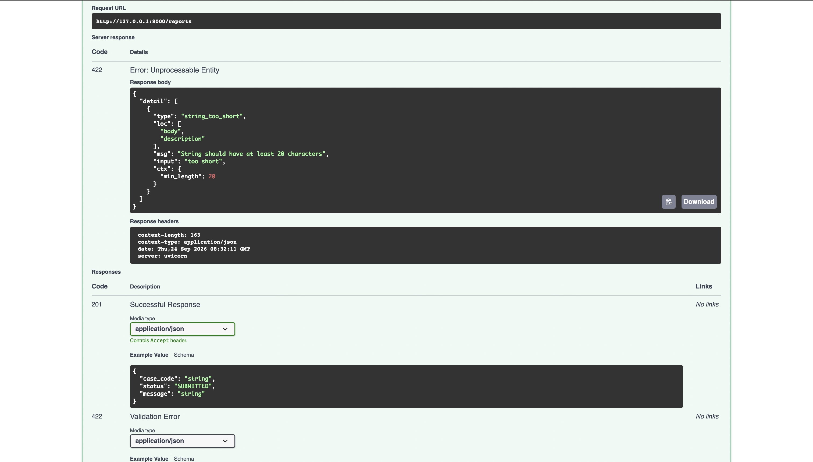

**14. The permanent-close rule enforced:** a resolved case cannot be reopened, even by a moderator.

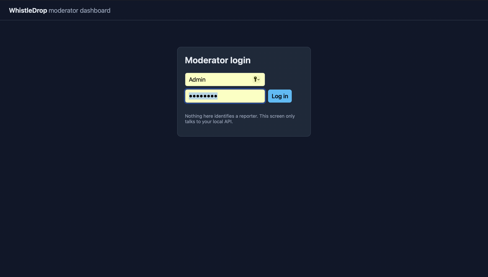

## The moderator dashboard
`/dashboard` is a single self-contained HTML page (`app/static/dashboard.html`) that talks to the same public API — it has no special access of its own. It shows report counts, lets you filter and search reports, change status, add a note, and open evidence images. It stores the login token only in memory in the browser tab (not `localStorage`), so it disappears when the tab is closed or refreshed. This is a working example rather than a production admin panel: a real deployment would add features like audit logs and account management.

## Evidence uploads and privacy
A report accepts up to 3 images (PNG or JPEG, 5 MB each). Photos often carry hidden metadata — GPS coordinates, camera model, timestamps — that could identify who took them. `app/evidence.py` rebuilds every uploaded image from its raw pixels before storing it, which removes all of that metadata; only the visible picture survives. Files are stored as bytes in the database, not on disk, so they aren't lost on hosts with a temporary file system, and they can only be downloaded by a logged-in moderator.

## How anonymity is maintained
1. **No accounts, no identity fields.** The database has no column for name, email, IP address, device or user agent. Data that is never stored cannot leak.
2. **Case codes are random and stored hashed.** Codes come from Python's `secrets` module (128 bits). Only a SHA-256 hash is stored, so a database leak does not reveal usable codes.
3. **Moderators see reports, never reporters.** Moderator responses are built from a schema that has no reporter fields. Moderator actions are stored with the moderator's id for auditing, but that id is never shown to reporters.
4. **Coarse timestamps.** Report times are rounded down to the hour so a report cannot be matched to "someone who was online at 14:03". Status-update times stay exact, since those are moderator actions, not reporter actions.
5. **Evidence images are stripped of metadata** before they are stored (see above).
6. **No access logging.** The server is started with `--no-access-log` so client IP addresses are not written to logs.
7. **Uniform errors.** A wrong case code and a non-existent one both return the same `404`.

## Example requests and responses
**Submit a report**
```bash
curl -X POST http://127.0.0.1:8000/reports -H "Content-Type: application/json" \
  -d '{"category":"OTHER","description":"Someone in the office keeps microwaving fish for lunch every single day at 1pm and the entire third floor now smells like a dock. This is a crime against humanity and possibly several OSHA regulations.","evidence_url":"https://example.com/photo-of-the-cursed-microwave"}'
```
```json
{ "case_code": "WD-NKWtzRE44QtHIvBvkBTIzQ", "status": "SUBMITTED", "message": "Save this case code. It is the only way to check your report and it cannot be recovered." }
```

**Check status**
```bash
curl http://127.0.0.1:8000/reports/WD-NKWtzRE44QtHIvBvkBTIzQ
```
```json
{ "category": "OTHER", "status": "SUBMITTED",
  "submitted_at": "2026-09-22T13:00:00", "last_updated": "2026-09-22T13:00:00",
  "updates": [], "evidence_file_count": 0 }
```

**Upload evidence**
```bash
curl -X POST http://127.0.0.1:8000/reports/WD-NKWtzRE44QtHIvBvkBTIzQ/evidence \
  -F "file=@fish-microwave-evidence.jpg"
```
```json
{ "message": "Evidence uploaded. Its metadata was removed for your privacy.",
  "file": { "id": 4, "content_type": "image/jpeg", "size_bytes": 47625, "created_at": "2026-09-22T13:00:00" } }
```

**Moderator moves the case through the workflow**
```bash
curl -X PATCH http://127.0.0.1:8000/moderator/reports/3/status \
  -H "Authorization: Bearer <token>" -H "Content-Type: application/json" \
  -d '{"status": "UNDER_REVIEW", "message": "We have identified a person of interest near the break room. Investigation is ongoing."}'
```
A follow-up note, still `UNDER_REVIEW`:
```bash
curl -X POST http://127.0.0.1:8000/moderator/reports/3/notes \
  -H "Authorization: Bearer <token>" -H "Content-Type: application/json" \
  -d '{"message": "Suspect apprehended near the toaster. Denies everything. The smell, however, does not lie."}'
```
Resolving it:
```bash
curl -X PATCH http://127.0.0.1:8000/moderator/reports/3/status \
  -H "Authorization: Bearer <token>" -H "Content-Type: application/json" \
  -d '{"status": "RESOLVED", "message": "Case closed. The fish microwaver has been re-educated and issued a designated \"smelly food\" microwave in the basement. Justice has prevailed."}'
```

**Reporter's final view**
```bash
curl http://127.0.0.1:8000/reports/WD-NKWtzRE44QtHIvBvkBTIzQ
```
```json
{ "category": "OTHER", "status": "RESOLVED",
  "submitted_at": "2026-09-22T13:00:00", "last_updated": "2026-09-22T14:00:00",
  "updates": [
    { "new_status": "UNDER_REVIEW", "message": "We have identified a person of interest near the break room. Investigation is ongoing.", "created_at": "2026-09-22T13:59:23" },
    { "new_status": "UNDER_REVIEW", "message": "Suspect apprehended near the toaster. Denies everything. The smell, however, does not lie.", "created_at": "2026-09-22T13:59:40" },
    { "new_status": "RESOLVED", "message": "Case closed. The fish microwaver has been re-educated and issued a designated \"smelly food\" microwave in the basement. Justice has prevailed.", "created_at": "2026-09-22T14:00:40" }
  ],
  "evidence_file_count": 1 }
```

**Wrong or unknown case code (404)**
```json
{ "detail": "Case not found" }
```

**Description too short (422)**
```json
{ "detail": [ { "type": "string_too_short", "loc": ["body", "description"], "msg": "String should have at least 20 characters", "input": "too short", "ctx": { "min_length": 20 } } ] }
```

**Invalid status change (409, on an already-closed case)**
```json
{ "detail": "This case is permanently closed (RESOLVED) and cannot be reopened." }
```

## Deployment
**Render (no Docker):**
1. Push this repo to GitHub (already done if you're reading this on GitHub).
2. On Render, create a **Blueprint** from the repo; it reads `render.yaml` and provisions a free PostgreSQL database plus the web service automatically. Or create the pieces by hand: a PostgreSQL database, then a Python web service with build command `pip install -r requirements-prod.txt` and start command `uvicorn app.main:app --host 0.0.0.0 --port $PORT --no-access-log`.
3. Set the environment variables `WHISTLEDROP_ENV=production`, `WHISTLEDROP_SECRET` (a random 32+ character string), and `DATABASE_URL` (Render fills this in for you from the database).
4. Optionally set `BOOTSTRAP_MODERATOR_USERNAME` and `BOOTSTRAP_MODERATOR_PASSWORD` so a moderator account exists on first boot, since Render's free plan doesn't give shell access to run `create_moderator.py`.

**Docker, locally or on any host that runs containers:**
```bash
docker compose up --build
```
This starts the API together with a real PostgreSQL database (see `docker-compose.yml`). Change the passwords in that file before using it for anything beyond local testing.

## Assumptions and design decisions
- Moderators are created by an administrator running `create_moderator.py`, or via the `BOOTSTRAP_MODERATOR_*` environment variables on hosts with no shell access. There is no public moderator sign-up.
- If `WHISTLEDROP_SECRET` is not set, the app falls back to a fixed development-only key so it still runs locally. Setting `WHISTLEDROP_ENV=production` without a real `WHISTLEDROP_SECRET` (32+ characters) makes startup fail on purpose, so this fallback can't accidentally reach a real deployment.
- Status messages and notes are visible to the reporter, so moderators should not put confidential information in them.
- The workflow is strict and **permanent**: a report cannot skip `UNDER_REVIEW`, and `RESOLVED`/`DISMISSED` cannot be reopened or receive further status changes, notes, or evidence.
- If a reporter loses their case code it cannot be recovered. This is the price of not storing any identity.
- Only PNG and JPEG evidence images are accepted, up to 3 per report and 5 MB each, to keep the database small and the images easy to validate.
- SQLite is used for local development for simplicity; the same code runs on PostgreSQL by setting `DATABASE_URL` (used automatically in the Docker and Render setups).
- If deployed behind a proxy or host that logs IP addresses, that layer must be configured not to log them too.

## Automated tests
```bash
python -m pytest -v
```
28 tests cover: report submission and validation, case-code uniqueness, evidence upload (including metadata stripping and the 3-file limit), the moderator login and dashboard, status transitions and their permanence, notes, and that no reporter-identifying field ever appears in a moderator-facing response.

## Possible further improvements
Rate limiting on login and submission, a public "closed case" statistics page, search across evidence file metadata, an audit log page in the dashboard.